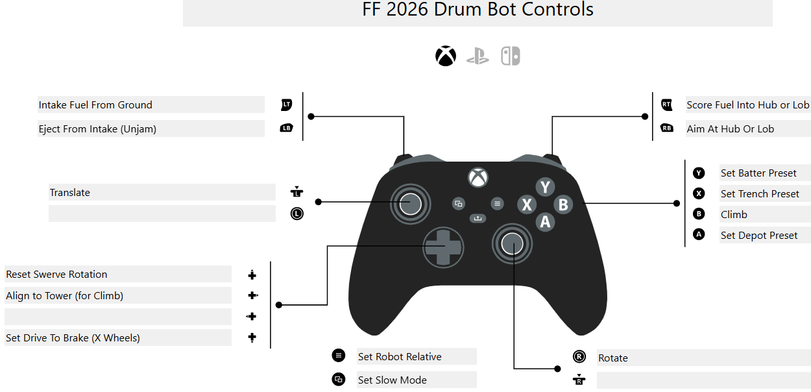

# robot-2026-rewrite

**FRC Team 503 (Frog Force) — 2026 REBUILT Robot Code**

This is a ground-up rewrite of our robot code for the 2026 FIRST Robotics game **REBUILT**.

### Controller Layout

[View interactive version on PadCrafter](https://www.padcrafter.com/?templates=FF+2026+Drum+Bot+Controls&plat=0&leftStick=&rightStickClick=&rightStick=Rotate&leftStickClick=Translate&dpadUp=Reset+Swerve+Rotation&dpadRight=Align+to+Tower+%28for+Climb%29&dpadLeft=&dpadDown=Set+Drive+To+Brake+%28X+Wheels%29&backButton=Set+Slow+Mode&startButton=Set+Robot+Relative&yButton=Set+Batter+Preset&xButton=Set+Trench+Preset&aButton=Set+Depot+Preset&bButton=Climb&leftTrigger=Intake+Fuel+From+Ground&rightTrigger=Score+Fuel+Into+Hub+or+Lob&leftBumper=Eject+From+Intake+%28Unjam%29&rightBumper=Aim+At+Hub+Or+Lob&col=%2523242424%2C%2523606A6E%2C%2523FFFFFF)

[If using a keyboard, read the simulation docs for this repository](../sim/README.md)

## Disclaimer

⚠️ **This is a personal/educational rewrite and is NOT the official FRC Team 503 repository.** It is maintained separately and independently from the actual Frog Force codebase.

**Note:** Team-specific assets (CAD models, proprietary designs, etc.) are intentionally excluded from this repository to comply with FIRST guidelines and protect team intellectual property. Only code and general software architecture are published here.